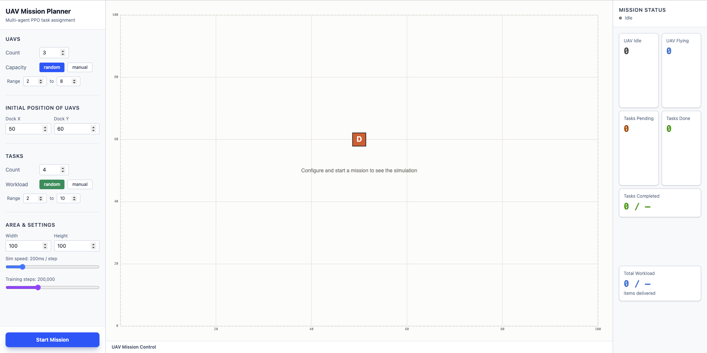
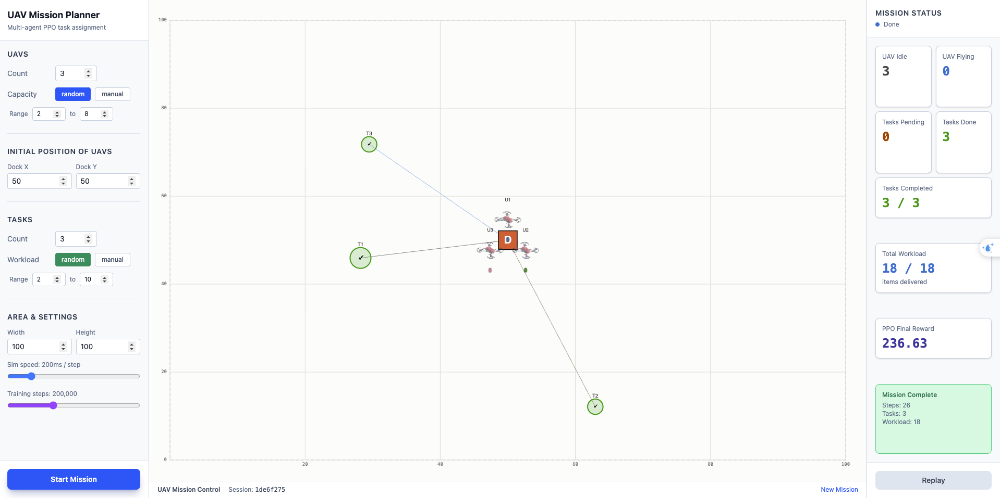

# UAV Multi-Agent PPO Task Assignment

A full-stack web application for visualizing cooperative UAV task assignment optimized by multi-agent Proximal Policy Optimization (PPO).

## Goal

The goal is to develop a system in which multiple UAVs transport medical supplies to disaster areas. Multiple UAVs cooperate to quickly and efficiently carry medical supplies to the necessary locations within the disaster area.

## Demo

**Mission planner** — configure UAV count/capacity, task count/workload, and area/dock settings before launching:



**Mission complete** — all tasks finished, stats panel showing final PPO reward and workload delivered:



## Architecture

- **Backend**: Python + FastAPI + PyTorch (multi-agent PPO)
- **Frontend**: React + TypeScript + Vite + Tailwind CSS
- **Communication**: REST API + WebSocket (real-time sim updates)

## How it works

1. Configure N UAVs (with capacities) and M tasks (with workloads) in the UI
2. Press **Start Mission** — the backend trains a PPO policy from scratch (~30–90s)
3. A real-time training progress bar shows reward improvement
4. Once training finishes, the simulation runs automatically using the trained policy
5. Watch UAVs fly from the dock, cooperate on tasks, and return home

## Quick Start

### Backend

```bash
cd /path/to/project
pip install -r backend/requirements.txt
python -m uvicorn backend.main:app --reload --port 8000
```

### Frontend

```bash
cd frontend
npm install
npm run dev
```

Then open http://localhost:5173

## Windows Desktop Build (.exe)

The app can be packaged as a standalone Windows app: a single FastAPI server
serves both the built frontend and the API/WebSocket, and a small launcher
opens it in your default browser.

**Get a build:** push a `v*` tag (e.g. `git tag v1.0.0 && git push origin v1.0.0`),
or run the *Build Windows EXE* workflow manually from the Actions tab. Download
the `UAVMissionPlanner-windows` artifact, unzip it, and run `UAVMissionPlanner.exe`
— no Python or Node install needed on the target machine.

**Build it yourself on Windows:**

```powershell
cd frontend; npm ci; npm run build; cd ..
pip install -r backend/requirements.txt pyinstaller
pyinstaller desktop/build.spec --noconfirm
# → dist/UAVMissionPlanner/UAVMissionPlanner.exe
```

The build bundles PyTorch, so expect it to take a while and produce a large
(multi-hundred-MB) `dist/UAVMissionPlanner/` folder — that's normal.

## Features

- **Multi-agent PPO**: IPPO with parameter sharing — all UAVs share one network
- **Cooperative tasks**: Multiple UAVs can combine capacity to complete a single task
- **Configurable scenarios**: Random or manual capacity/workload settings
- **Real-time visualization**: 2D canvas showing UAV paths, cooperation links, task status
- **Live stats**: UAV idle/flying counts, task completion, total workload delivered
- **Pause/resume/replay** simulation controls

## Project Structure

```
backend/
  env/         UAVTaskEnv (Gymnasium-style multi-agent environment)
  ppo/         ActorCritic, RolloutBuffer, PPOAgent, Trainer
  simulation/  SimRunner (inference-mode step loop)
  api/         FastAPI routes + WebSocket manager
  schemas/     Pydantic config + message models

frontend/src/
  components/  ConfigPanel, SimCanvas, StatsPanel, TrainingProgress
  store/       Zustand state (simStore, configStore)
  hooks/       useWebSocket
  types/       TypeScript interfaces
  api/         REST + WebSocket client
```
